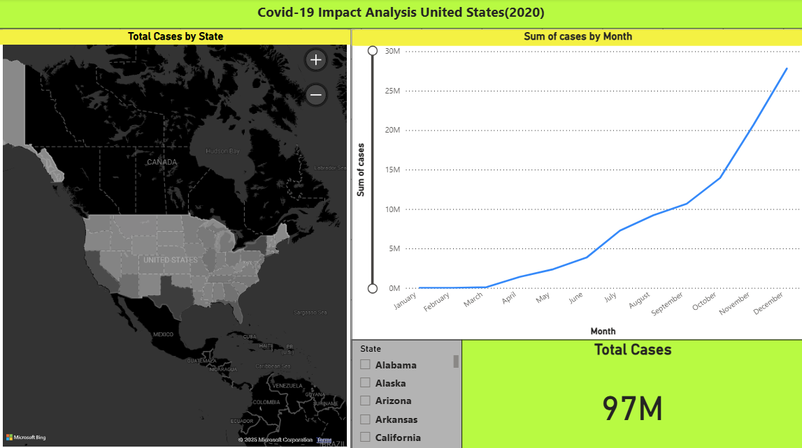

# 🦠 COVID-19 Impact Analysis

This project analyzes the spread and impact of COVID-19 across U.S. counties in 2020 using a complete data pipeline. The raw dataset is stored and queried using AWS services, processed with Python in a Jupyter notebook, and visualized through an interactive dashboard in Power BI. The goal is to demonstrate how real-world data can be transformed into actionable insights using modern cloud-based and analytics tools.

---

## 🔄 Data Flow Overview

The project begins by sourcing raw COVID-19 case data from the New York Times GitHub repository and uploading it to Amazon S3, where it is stored as the data lake. AWS Glue is then used to crawl the S3 bucket, infer the data schema, and register it in the AWS Glue Data Catalog. With the schema available, Amazon Athena enables SQL queries to be executed directly on the data in S3. These SQL queries are used to filter and extract a representative sample (e.g., 50,000 rows from 2020) and prepare it for analysis.

The extracted dataset is then cleaned, transformed, and aggregated using Python in a Jupyter notebook with the help of the `pandas` library. Finally, the processed dataset is imported into Power BI to build interactive dashboards that visualize state-wise trends, total cases, and temporal patterns.

---

## 🗺️ Architecture Diagram

---

## 🛠️ Tools & Technologies

- **Amazon S3** – Cloud storage for raw and processed datasets  
- **AWS Glue** – Metadata cataloging and schema discovery  
- **Amazon Athena** – Serverless querying of data stored in S3  
- **Python (Jupyter Notebook)** – Data extraction, transformation, and export using `pandas`  
- **Power BI** – Interactive dashboard development and visual storytelling  

---

## 📊 Dashboard

Here is a snapshot of the final Power BI dashboard created using the processed data:

**Dashboard Features:**

- 🗺️ Filled Map: Total COVID-19 cases by U.S. state using color gradients  
- 📈 Line Chart: Monthly trend of reported cases  
- 🔢 KPI Card: Total case count for 2020  
- 🎚️ Slicer: Interactive state filter affecting all visuals  

This dashboard enables users to explore the temporal and geographic evolution of the COVID-19 pandemic in the U.S.

---

## 📚 Data Source

- [New York Times COVID-19 Dataset](https://github.com/nytimes/covid-19-data)  
  © 2020 The New York Times. Data based on reports from state and local health agencies.  
  This data is available for non-commercial use under the [Creative Commons Attribution-NonCommercial 4.0 License](https://creativecommons.org/licenses/by-nc/4.0/).  
  If used publicly, please credit: “The New York Times.”

---
